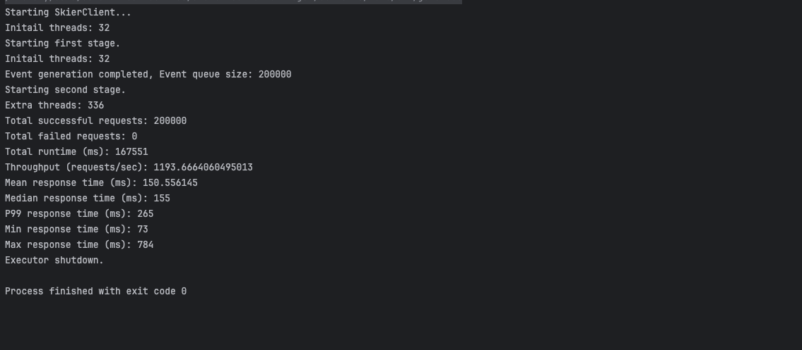

# Assignment3
### Github:https://github.com/XieWen2000/Distributed-System/tree/main/Desktop/Assignment3
### 1. Database Design:

### Design Description 
1.` SkierData` Table:
* `skierId`: Primary key, identifies the skier.
* `season`: Represents the season in which the activity takes place.
* `activities`: Stores all activities for the skier as a 
JSON object. This allows for embedding multiple fields 
(such as `day`, `resortId`, `checkIn`, `lifts`, etc.) within one column.

2. `ResortActivity` Table:

`resortId`: Identifier for the resort.
`checkIn`: The day the skiers checked in, used as part of the primary key.
`uniqueSkiers`: Stores an array of unique skier IDs in JSON format, representing all skiers who visited the resort on that day.

### 2. Database Query:
* For skier N, how many days have they skied this season?

`  db.Skiers.aggregate([
  { $match: { skierId: N, season: seasonID } },
  { $unwind: "$activities" },
  { $group: { _id: "$skierId", uniqueDays: { $addToSet: "$activities.day" } } },
  { $project: { totalDays: { $size: "$uniqueDays" } } }
  ]);`
* For skier N, what are the vertical totals for each ski day?

`  db.Skiers.aggregate([
  { $match: { skierId: N } },
  { $unwind: "$activities" },
  { $project: {
  day: "$activities.day",
  vertical: { $sum: { $map: {
  input: "$activities.lifts",
  as: "lift",
  in: { $multiply: ["$$lift.liftId", 10] }
  } } }
  } }
  ]);
`
* For skier N, show me the lifts they rode on each ski day.

`db.Skiers.aggregate([
{ $match: { skierId: N } },
{ $unwind: "$activities" },
{ $project: {
day: "$activities.day",
lifts: "$activities.lifts"
} }
]);`
* How many unique skiers visited resort X on day N?

`db.ResortActivity.findOne({ resortId: X, checkIn: N }).uniqueSkiers.length;
`
### 3. Test Output
Bandwidth:

Client deployed in EC2 waiting for requests:

Client deployed in EC2 has stored all requests in Mangodb:

Consumer Channels in RabbitMq:

Bandwidth of RabbitMq:

